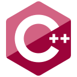
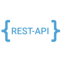

# 
Hey there, I'm Ashutosh Gaurav 👋

### 
A Full Stack Developer 💻

## About me
- 👨🏽‍💻 I’m currently an Final year Undergrad student at Indian Institute of Information Technology,Ranchi. (IIIT R)
- 🤔 My interest lies in Software Development.
- 💬 Ask me about anything, I am happy to help.
- 🌏 Check out my website: https://ashuportf.netlify.app/
- 📫 Email me at: ashu00665@gmail.com
- ⚡ Fun fact: I am curious in learning techs which are apar of my domain👨‍💻 !

## Connect with me

  &nbsp;
  &nbsp;
  &nbsp;

  &nbsp;
  &nbsp;
  &nbsp;

## Languages / Frameworks / Tools / AWS

  &nbsp;
  &nbsp;
  &nbsp;

  &nbsp;
  &nbsp;
  &nbsp;
  &nbsp;

  &nbsp;
  &nbsp;
  &nbsp;
  &nbsp;
  &nbsp;
  &nbsp;
  &nbsp;
  &nbsp;

  &nbsp;
  &nbsp;

  &nbsp;
  &nbsp;
  &nbsp;
  &nbsp;

  &nbsp;
  &nbsp;
  &nbsp;
  &nbsp;
  &nbsp;
  &nbsp;

  

  <kbd></kbd>

  <kbd></kbd>

  <kbd></kbd>

